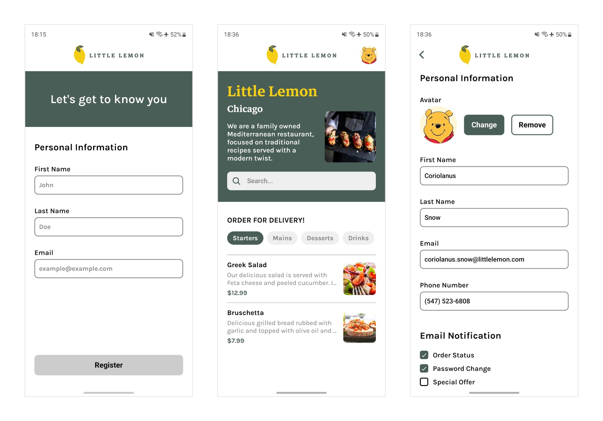

# Meta React Native Capstone Project

This project serves as the capstone for the **Meta React Native Specialization** and is developed in **React Native** using **Expo** as a comprehensive mobile solution for **Little Lemon**, a Mediterranean restaurant. It offers a cross-platform implementation of the Little Lemon restaurant app, showcasing modern development practices such as SQLite persistence, reactive state management, remote data fetching, and editable user profiles. The app provides a smooth, responsive, and consistent experience on both Android and iOS devices, reflecting the core skills and concepts acquired throughout the specialization program.


## Project Highlights

- **Cross-Platform Development**: Built with **React Native** and **Expo 46**, ensuring seamless compatibility across Android and iOS devices.
- **Offline-First Caching**: Menu data is fetched from a remote JSON source during the initial launch and cached in SQLite for complete offline access.
- **Local Persistence**: User and menu data are securely stored using **AsyncStorage** and **SQLite**, ensuring state retention across sessions.
- **Editable Profile**: Users can update their name, email, phone number, profile image, and notification preferences, with data stored locally.
- **Dynamic Filtering**: Menu items can be filtered in real-time by category using **React State**.
- **Theme Adaptation**: Automatically adjusts between light and dark mode based on system preferences.
- **Custom Components**: Reusable UI elements such as filters, alerts, and headers enhance code maintainability and design consistency.
- **Error-Handled User Experience**: Comprehensive error handling and contextual alerts ensure smooth recovery from network or input issues.
- **Reactive State Management**: UI dynamically reflects database or state updates, maintaining real-time responsiveness.
- **Modern UI/UX Design**: Clean, accessible, and responsive layouts deliver an intuitive user experience across all screen sizes.


## Table of Contents

- [Project Overview](#project-overview)
- [Features](#features)
- [Technologies Used](#technologies-used)
- [App Architecture and Data Flow](#app-architecture-and-data-flow)
- [Setup Instructions](#setup-instructions)
- [Source Files and Components](#source-files-and-components)
- [Behavioral Notes and Edge Cases](#behavioral-notes-and-edge-cases)
- [License](#license)


## Project Overview

The **Little Lemon** React Native application was developed as the capstone project for the **Meta React Native Specialization**. This project unifies the core concepts learned throughout the specialization, including cross-platform UI development, local data persistence, state management, and API integration. The app enables users to explore the restaurant’s menu, filter items by category, search item by name and manage their profile with editable personal details and a profile image. Built with **Expo**, it features responsive design, theme adaptation based on system preference, and offline-first caching using **SQLite**. The project exemplifies modern mobile development practices for creating efficient, consistent, and user-focused applications for both Android and iOS platforms.

[](./docs/screenshots/)


## Features

- **Onboarding Flow**: Introduces the app to first-time users and stores completion status for subsequent launches.
- **Editable Profile**: Allows users to update their name, email, preferences, and profile image, with data securely persisted locally.
- **Menu Management**: Fetches the restaurant’s menu from a remote JSON source and caches it in **SQLite** for offline access.
- **Dynamic Filtering**: Enables real-time category-based menu filtering using React state and context.
- **Persistent Storage**: Maintains onboarding and profile details using **AsyncStorage** for consistent user experience.
- **Custom Components**: Employs modular UI elements such as filters, alerts, headers, and separators for maintainable and reusable structure.
- **Responsive UI**: Ensures consistent and adaptive layouts across different screen sizes and orientations.
- **Theme Adaptation**: Automatically switches between light and dark modes based on the system theme preference.


## Technologies Used

- **React Native (Expo SDK 46)**: Cross-platform framework for building Android and iOS applications.
- **JavaScript (ES6+)**: Primary programming language for application logic and UI development.
- **Expo Libraries**: Provide integration for SQLite storage, image picking, and streamlined deployment.
- **SQLite**: Local database for caching menu data and supporting offline functionality.
- **AsyncStorage**: Persistent key-value storage for onboarding state and user profile data.
- **React Navigation**: Manages in-app navigation through stack and tab-based routing.
- **React Hooks and Context API**: Facilitate modular, reactive, and shared state management.
- **Fetch API**: Handles remote JSON data retrieval for menu synchronization.
- **StyleSheet API**: Defines consistent, reusable component-level styling across the app.


## App Architecture and Data Flow

The app is implemented using **MVVM (Model–View–ViewModel)** with functional components, **React Hooks**, **Context API** for centralized state management and **SQLite** for persistance.

#### Architecture Overview
- **Model**
  - Menu data fetched from a remote JSON source and stored in **SQLite**
  - Profile and onboarding state stored in **AsyncStorage**

- **View (React Components)**
  - Renders screens (Onboarding, Home, Menu, Search, Profile)
  - Responds to state changes and user interactions in real time

- **ViewModel (Hooks & Context)**
  - Synchronizes menu and profile data
  - Provides data updates and triggers re-renders via React Context

#### Data Flow
- **Startup**
  - On app launch, onboarding completion is checked via AsyncStorage
  - If the user has completed onboarding, the Home screen is displayed
  - If the user has not completed onboarding, the Onboarding screen is displayed

- **Menu Synchronization**
  - SQLite is queried for menu data
  - If empty, data is fetched from remote JSON and persisted locally
  - UI updates automatically when data becomes available

- **Search and Filtering**
  - Search and filtering are performed client-side for responsiveness
  - The UI reflects queries and filters immediately

- **Profile Management**
  - Profile data is editable and saved locally.
  - Data persists across sessions using AsyncStorage.

- **Error Handling**
  - If a network request fails, an alert is displayed with connectivity error message
  - If any text input is invalid, an alert is displayed with error message
  - If remote images fail to load, text content is still displayed

- **Onboarding State**
  - Onboarding completion data is stored in **AsyncStorage**
  - If onboarding data is found, the user is considered onboarded
  - Signing out from the Profile screen clears the stored data, returning the user to the Onboarding screen


## Setup Instructions

1. Clone the repository:
   ```bash
   git clone https://github.com/TANMOY-TRC/Meta-React-Native-Capstone.git
   ```

2. Navigate to the project directory:
   ```bash
   cd Meta-React-Native-Capstone
   ```

3. Install dependencies:
   ```bash
   npm install
   ```

4. Start the development server:
   ```bash
   npm start
   ```

5. Run the application:

   Scan the **QR Code** using the **Expo Go** app on a mobile device, or run on an emulator:
   ```bash
   npm run android
   ```
   ```bash
   npm run ios
   ```


## Source Files and Components

The main source code files of the project are presented below, along with the responsibilities they serve.

```plaintext
Little-Lemon
├── assets
│   ├── fonts                             # Custom fonts used throughout the app
│   └── images                            # App icons, logos, and media assets
├── components
│   ├── AppWrapper.js                     # Wraps the app components
│   ├── Avater.js                         # User profile image with fallback
│   ├── Checkbox.js                       # Custom checkbox component
│   ├── CustomAlert.js                    # Custom alert component
│   ├── Filters.js                        # Menu category filter component
│   ├── Header.js                         # Top header bar
│   ├── Hero.js                           # Introductory banner section
│   ├── MenuItems.js                      # Menu item component
│   └── Separator.js                      # Divider for visual spacing in UI
├── constants
│   ├── colors.js                         # Centralized color definitions
│   └── themes.js                         # Light and dark mode theme configurations
├── context
│   ├── AppContext.js                     # Global context managing app-wide state
│   └── ThemeContext.js                   # Controls theme switching
├── hooks
│   └── useUpdateEffect.js                # Custom hook executed on updates
├── navigation
│   └── Navigation.js                     # Defines and manages navigation stack
├── network
│   └── network.js                        # Handles API requests and remote fetching
├── screens
│   ├── Home.js                           # Home screen with menu listing
│   ├── Onboarding.js                     # Onboarding flow for new users
│   ├── Profile.js                        # Editable user profile
│   └── Splash.js                         # Splash screen
├── storage
│   ├── async
│   │   └── userStorage.js                # Manages data in AsyncStorage
│   └── database
│       └── database.js                   # SQLite database functions
├── utils
│   ├── formValidation.js                 # Validates form input
│   └── stringHelpers.js                  # Utility functions for text manipulation
├── App.js                                # Root component
├── app.json                              # Expo configuration file
├── babel.config.js                       # Babel configuration file
├── package.json                          # Project dependencies and scripts
└── package-lock.json                     # Dependency lock file
```


## Behavioral Notes and Edge Cases

- **Initial Synchronization**: On app startup, the local store is checked for existing menu data; if none exists, the remote JSON is fetched and persisted.
- **Data Consistency**: Menu and profile states are synchronized between SQLite and AsyncStorage.
- **Offline Mode**: Cached menu and saved profile data remain accessible offline.
- **Search and Filtering**: Client-side searching and filtering is applied for instant results.
- **Profile Editing**: Image selection and text validation are handled locally; invalid inputs trigger alerts.
- **Error Handling**: Alerts messages appear on network errors and validation errors.
- **Image Loading**: Images are fetched directly via URL. No caching layer is implemented by default.


## License

This project is licensed under the [MIT License](./LICENSE).
